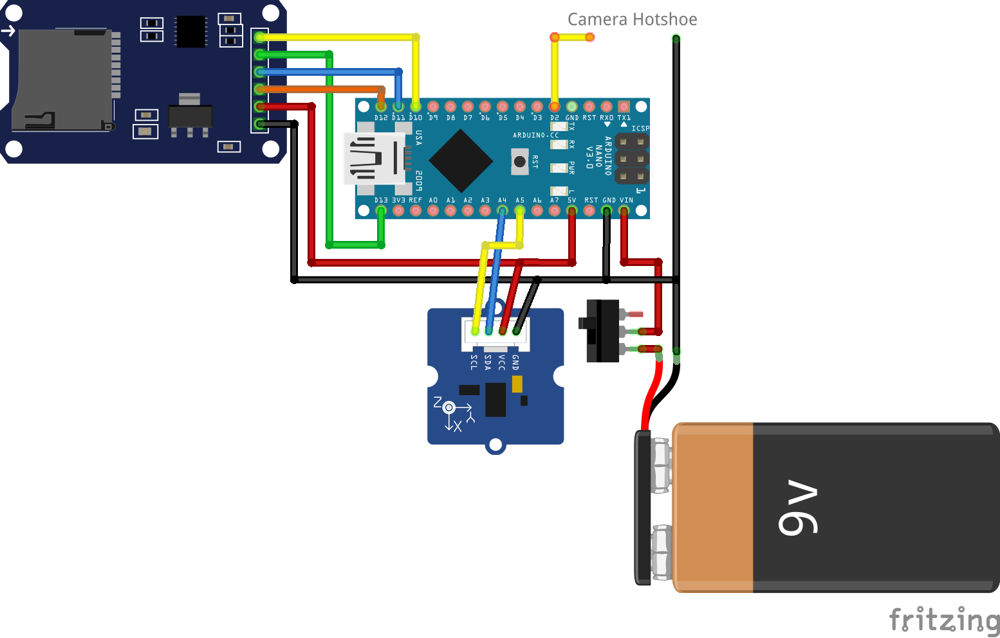

# Arduino Gravity Recorder

## Dependencies

* Arduino SD library
* Arduino SPI library
* Arduino Wire library
* arduino-cli
* arduino:avr core
* avr-gcc
* CMake 3.11

For the recording_parser you'll also need Eigen 3.3.

## Compilation

First, check which serial port your Arduino is connected to.

```bash
arduino-cli board list
```

This step will automatically fetch the [Arduino-CMake-Toolchain](https://github.com/a9183756-gh/Arduino-CMake-Toolchain), compile the code, and upload it to your Arduino Nano.

```bash
mkdir build
cd build
cmake -DCMAKE_BUILD_TYPE=Release ..
make

# Replace /dev/ttyUSB0 with the correct port for your setup.
make upload-arduino_gravity_recorder SERIAL_PORT=/dev/ttyUSB0
```

To compile the recording_parser:

```bash
mkdir build-parser
cd build-parser
cmake -DCMAKE_BUILD_TYPE=Release ../recording_parser
make
```

To compile and run the tests:

```bash
mkdir build-test
cd build-test
cmake -DCMAKE_BUILD_TYPE=Release ../test
make
./tests
```

## Arduino Setup

Apologies to all EE students for this ugly schematic.



The pins on the microSD card reader, from top to bottom, are:
* CS
* SCK
* MOSI
* MISO
* VCC
* GND

This should work with any of the commonly available microSD card readers, I do however think that the IMU has to be a Grove IMU 10DOF v2, otherwise you'll have to swap out the library used in the code.

The connections at the top right should go to the center pin and the surrounding contact on the camera hotshoe, the order doesn't matter. See ISO 10330 for more details.
